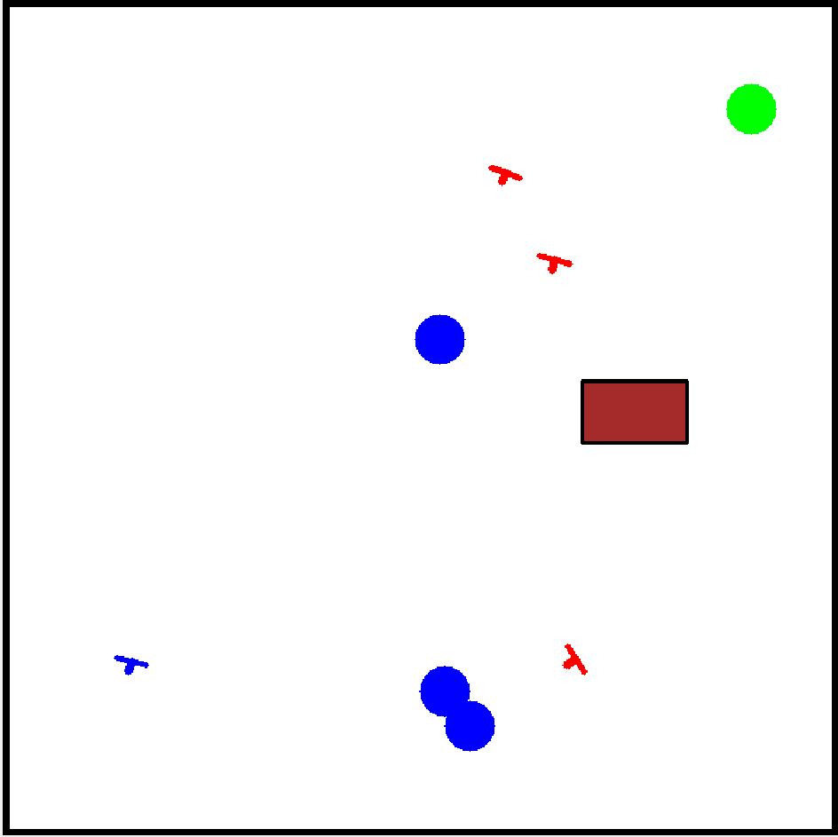

```markdown
# LiteSocNavGym

**LiteSocNavGym** is a lightweight Gymnasium environment designed for social navigation tasks involving robots, humans, and tables. The environment simulates scenarios where a robot navigates toward a goal while avoiding collisions with humans and static obstacles (tables).

## Table of Contents

- [Features](#features)
- [Installation](#installation)
- [Usage](#usage)
  - [Running an Example](#running-an-example)
- [Environment Details](#environment-details)
  - [Observation Space](#observation-space)
  - [Action Space](#action-space)
  - [Rewards](#rewards)
- [Configuration](#configuration)
- [Testing](#testing)
- [Contributing](#contributing)
- [License](#license)
- [Contact](#contact)

## Features

- **Dynamic Agents:** Both robots and humans move toward their respective goals.
- **Collision Avoidance:** Implements collision detection and avoidance mechanisms.
- **Customizable Parameters:** Adjust the number of humans, tables, rewards, and more.
- **Efficient Rendering:** Visualize the environment using OpenCV with minimal resource usage.

## Installation

### Prerequisites

- Python 3.7 or higher
- `pip` package manager

### Clone the Repository

```bash
git clone https://github.com/goodluckoguzie/LiteSocNavGym.git
cd LiteSocNavGym
```

### Install the Environment

Simply place the `socnav_env.py` file in the directory or path where it can be accessed by your scripts. No installation is necessary, but ensure that the environment is in the same directory or properly referenced in your project.

```bash
# Ensure the file is placed in the same directory
# or the correct path where it is being imported.
```

### Optional: Create a Virtual Environment

```bash
python -m venv venv
source venv/bin/activate  # On Windows: venv\Scripts\activate
```

### Install Dependencies

It's recommended to install dependencies listed in `requirements.txt` to ensure that the environment works as expected.

```bash
pip install -r requirements.txt
```

## Usage

### Running an Example

An example script is provided to demonstrate how to interact with the environment for 5 episodes.

1. Navigate to the `examples/` directory:

   ```bash
   cd examples
   ```

2. Run the example script:

   ```bash
   python example_run.py
   ```

This script initializes the environment, runs 5 episodes, takes random actions, and renders the environment until each episode terminates.

#### Example Script: `example_run.py`

```python
from LiteSocNavGym.socnav_env import LiteSocNavGym

def run_multiple_episodes(num_episodes=5):
    try:
        # Initialize environment directly
        env = LiteSocNavGym(render_mode='rgb_array')  # Use 'rgb_array' for visualization
    except Exception as e:
        print(f"Failed to initialize the environment: {e}")
        return

    try:
        for episode in range(num_episodes):
            obs, info = env.reset()
            done = False
            truncated = False
            step = 0
            total_reward = 0
            print(f"\n--- Episode {episode + 1} ---")
            
            while not done and not truncated:
                action = env.action_space.sample()  # Random action
                obs, reward, done, truncated, info = env.step(action)
                total_reward += reward
                step += 1
                env.render()
            
            print(f"Episode {episode + 1} finished after {step} steps with total reward {total_reward:.2f}")
    except Exception as e:
        print(f"An error occurred during the simulation: {e}")
    finally:
        env.close()

# Run the example for 5 episodes
run_multiple_episodes(5)
```

This script simulates a robot navigating toward a goal while avoiding humans and tables in each of the episodes.

---

## Environment Details

### Environment Visualization

Below is an image of the environment with the following components:

- **Blue Circle:** Represents the goal of the humans.
- **Red Objects:** Represent humans in the environment.
- **Blue Object:** Represents the agent (robot).
- **Green Circle:** Represents the robot's goal.
- **Broad Rectangular Surface:** Represents the table.



### Observation Space

- **Robot's Orientation:**
  - `[cos(theta), sin(theta)]` if `robot_view` is `True`.
  - `[x, y, cos(theta), sin(theta)]` if `robot_view` is `False`.

- **Goal's Position:**
  - Relative to the robot if `robot_view` is `True`.
  - Absolute position if `robot_view` is `False`.

- **Humans' Positions and Orientations:**
  - Relative to the robot if `robot_view` is `True`.
  - Absolute positions and orientations if `robot_view` is `False`.

- **Tables' Positions and Sizes:**
  - Relative to the robot if `robot_view` is `True`.
  - Absolute positions and sizes if `robot_view` is `False`.

- **Masks:**
  - Indicate active humans and tables.

### Action Space

The action space is continuous:

- **[advance, rotation]**
  - Advance: Controls the forward movement of the robot.
  - Rotation: Controls the rotational movement of the robot.

For the discrete version (`DiscreteLiteSocNavGym`), the action space is discrete with predefined action mappings.

### Rewards

- **Reach Reward:** +1.0 for reaching the goal.
- **Out of Map Reward:** -0.5 for moving out of bounds.
- **Max Ticks Reward:** -0.3 for exceeding the maximum number of steps.
- **Alive Reward:** -0.003 as a living penalty to encourage faster goal achievement.
- **Collision Reward:** -0.5 for collisions with humans or tables.
- **Discomfort Penalty:** Additional penalties for being too close to humans.

---

## Configuration

Configuration parameters can be adjusted either through the constructor or by modifying the `config.yaml` file.

### Example `config.yaml`:

```yaml
resolution: 700.0
resolution_view: 1000.0
map_size: 8.0
margin: 0.5
max_ticks: 250
timestep: 0.1
robot_radius: 0.15
goal_radius: 0.5
min_humans: 1
max_humans: 3
min_tables: 1
max_tables: 1
human_threshold: 0.4
reach_reward: 1.0
outofmap_reward: -0.5
maxticks_reward: -0.3
alive_reward: -0.003
collision_reward: -0.5
discomfort_distance: 0.5
discomfort_penalty_factor: 0.005
max_advance: 1.4
human_speed: 0.3
max_rotation: 1.57079632679  # Equivalent to np.pi / 2
milliseconds: 30
debug: 0
human_debug: False
robot_view: True
robot_size: 0.15
human_size: 0.15
goal_size: 0.25
table_size: [1.0, 0.6]
seed: 42
```

### Example Loading Configuration:

```python
import gymnasium as gym
import yaml

with open('config.yaml', 'r') as file:
    config = yaml.safe_load(file)

env = gym.make('LiteSocNavGym-v0', **config)
```

If `config.yaml` is not present, the environment uses default parameters.

---

## Testing

### Test Script

A test script ensures the environment initializes and runs without errors. The script is located in the `tests/` directory.

#### Example `tests/test_socnav_env.py`:

```python
import unittest
import gymnasium as gym
import numpy as np

class TestLiteSocNavGym(unittest.TestCase):
    def setUp(self):
        self.env = gym.make('LiteSocNavGym-v0', debug=0, human_debug=False)

    def test_reset(self):
        obs, info = self.env.reset()
        self.assertIsNotNone(obs)
        self.assertIsInstance(obs, np.ndarray)

    def test_step(self):
        obs, info = self.env.reset()
        action = self.env.action_space.sample()
        obs, reward, done, truncated, info = self.env.step(action)
        self.assertIsInstance(reward, float)
        self.assertIsInstance(done, bool)
        self.assertIsInstance(truncated, bool)
        self.assertIsInstance(info, dict)

    def tearDown(self):
        self.env.close()

if __name__ == '__main__':
    unittest.main()
```

### Running Tests

Navigate to the root directory of your repository and run:

```bash
python -m unittest discover tests
```

Expected Output:
```
...
----------------------------------------------------------------------
Ran 2 tests in 0.123s

OK
```

---

## Contributing

Contributions are welcome! Please follow these steps:

1. Fork the repository.
2. Create a new branch (`git checkout -b feature-branch`).
3. Make your changes.
4. Commit your changes (`git commit -m 'Add new feature'`).
5. Push to your branch (`git push origin feature-branch`).
6. Open a pull request.

---

## License

This project is licensed under the [MIT License](LICENSE).

---


## Contact

For questions or feedback, please reach out to:

**Goodluck Oguzie**  
[GitHub Profile](https://github.com/goodluckoguzie)  
```
